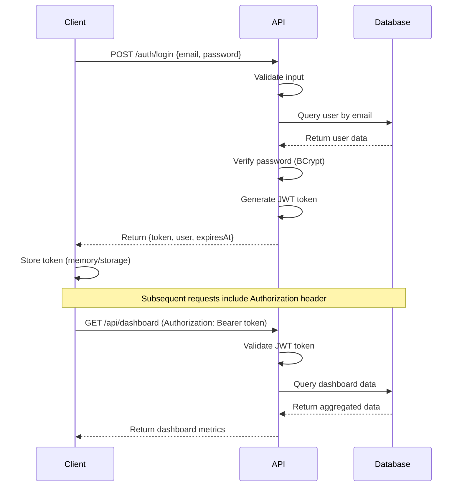
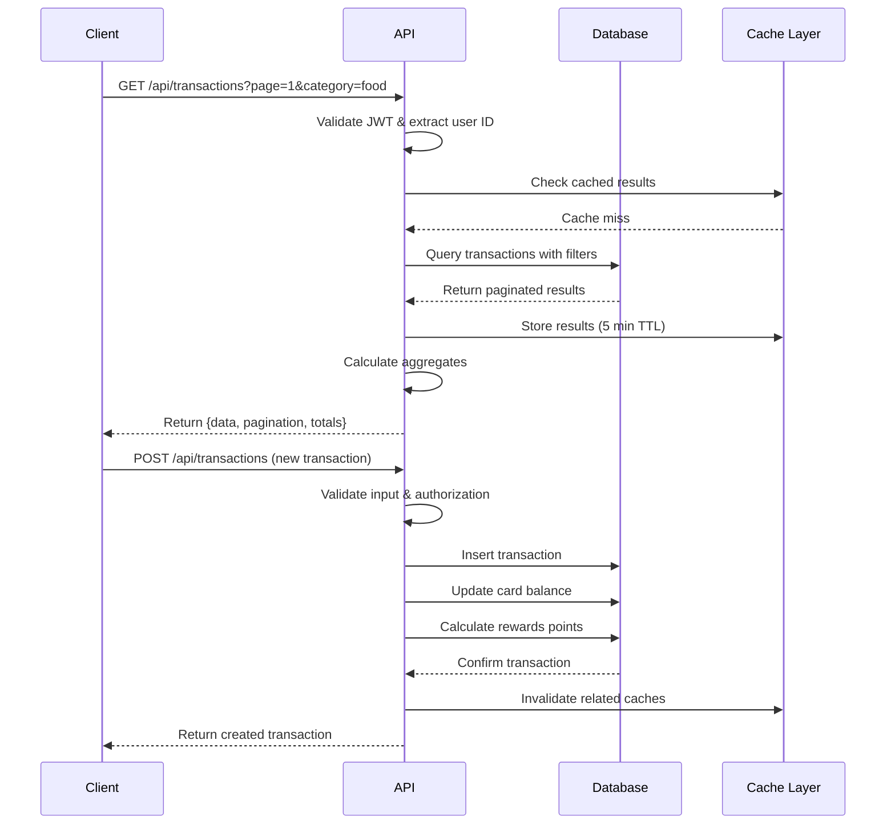
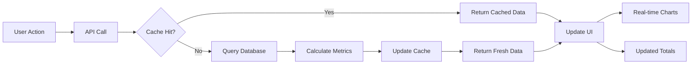

# FinPay Dashboard - System Design Documentation

## Table of Contents
- [Overview](#overview)
- [Architecture Patterns](#architecture-patterns)
- [System Components](#system-components)
- [Data Flow](#data-flow)
- [Security Architecture](#security-architecture)
- [Scalability Design](#scalability-design)
- [Technology Stack](#technology-stack)
- [Integration Points](#integration-points)

## Overview

FinPay Dashboard is a modern, secure credit card management application built with enterprise-grade architecture patterns. The system is designed to handle financial data securely while providing real-time insights and intuitive user experiences.

### Key Design Principles

1. **Security First**: Financial data requires the highest security standards
2. **Cost Optimization**: Designed to run on Azure's free tier
3. **Scalability**: Architecture supports growth from hundreds to thousands of users
4. **Maintainability**: Clean separation of concerns and well-defined interfaces
5. **Performance**: Optimized for fast load times and responsive user experience

## Architecture Patterns

### 1. Clean Architecture (Backend)

```
┌─────────────────────────────────────────────────────────────────┐
│                     Clean Architecture Layers                    │
├─────────────────────────────────────────────────────────────────┤
│  🌐 Presentation Layer (Controllers)                            │
│  ├── HTTP Request/Response handling                             │
│  ├── Input validation                                           │
│  ├── Authentication/Authorization                               │
│  └── API documentation (Swagger)                                │
│  │                                                             │
│  ⚙️  Application Layer (Services)                               │
│  ├── Business logic orchestration                              │
│  ├── Use case implementation                                    │
│  ├── Data transformation                                        │
│  └── External service integration                               │
│  │                                                             │
│  🏗️  Domain Layer (Models/Entities)                            │
│  ├── Core business entities                                     │
│  ├── Business rules and validation                             │
│  ├── Domain services                                           │
│  └── Interfaces (contracts)                                     │
│  │                                                             │
│  💾 Infrastructure Layer (Data Access)                          │
│  ├── Database context (Entity Framework)                       │
│  ├── External API clients                                       │
│  ├── File system access                                         │
│  └── Configuration management                                   │
└─────────────────────────────────────────────────────────────────┘
```

### 2. Component-Based Architecture (Frontend)

```
┌─────────────────────────────────────────────────────────────────┐
│                   React Component Architecture                   │
├─────────────────────────────────────────────────────────────────┤
│  📱 Page Components (App Router)                                │
│  ├── Route-based components                                     │
│  ├── Layout management                                          │
│  ├── SEO optimization                                           │
│  └── Server-side rendering                                      │
│  │                                                             │
│  🧩 Feature Components                                          │
│  ├── Dashboard widgets                                          │
│  ├── Transaction lists                                          │
│  ├── Chart visualizations                                       │
│  └── Form components                                            │
│  │                                                             │
│  🎨 UI Components (Atomic Design)                               │
│  ├── Atoms: Buttons, inputs, icons                             │
│  ├── Molecules: Form fields, cards                             │
│  ├── Organisms: Headers, sidebars                              │
│  └── Templates: Page layouts                                    │
│  │                                                             │
│  📊 State Management                                            │
│  ├── Global state (Redux Toolkit)                              │
│  ├── Server state (React Query)                                │
│  ├── Local state (useState)                                    │
│  └── Form state (React Hook Form)                              │
└─────────────────────────────────────────────────────────────────┘
```

## System Components

### Frontend Components (Next.js 14)

#### Core Pages
```typescript
// Page structure
src/app/
├── (auth)/
│   ├── login/page.tsx
│   └── register/page.tsx
├── dashboard/
│   ├── page.tsx                 // Main dashboard
│   ├── transactions/page.tsx    // Transaction management
│   ├── rewards/page.tsx         // Rewards tracking
│   └── analytics/page.tsx       // Spending insights
├── profile/
│   └── page.tsx                 // User profile management
└── layout.tsx                   // Root layout
```

#### Component Library
```typescript
// Component organization
src/components/
├── ui/                          // Base UI components (Shadcn)
│   ├── button.tsx
│   ├── card.tsx
│   ├── dialog.tsx
│   └── ...
├── charts/                      // Data visualization
│   ├── spending-chart.tsx
│   ├── category-pie-chart.tsx
│   └── trend-line-chart.tsx
├── forms/                       // Form components
│   ├── login-form.tsx
│   ├── transaction-form.tsx
│   └── profile-form.tsx
└── layout/                      // Layout components
    ├── header.tsx
    ├── sidebar.tsx
    └── footer.tsx
```

#### State Management Architecture
```typescript
// Redux store structure
store/
├── slices/
│   ├── authSlice.ts            // Authentication state
│   ├── transactionSlice.ts     // Transaction data
│   ├── dashboardSlice.ts       // Dashboard metrics
│   └── uiSlice.ts              // UI state (modals, loading)
├── api/                        // RTK Query API slices
│   ├── authApi.ts
│   ├── transactionApi.ts
│   └── dashboardApi.ts
└── store.ts                    // Store configuration
```

### Backend Components (ASP.NET Core)

#### API Controllers
```csharp
// Controller structure
Controllers/
├── AuthController.cs           // Authentication endpoints
├── DashboardController.cs      // Dashboard data
├── TransactionsController.cs   // Transaction CRUD
├── RewardsController.cs        // Rewards management
├── UsersController.cs          // User profile
└── AnalyticsController.cs      // Spending analytics
```

#### Service Layer
```csharp
// Service organization
Services/
├── Interfaces/
│   ├── IAuthenticationService.cs
│   ├── ITransactionService.cs
│   ├── IRewardService.cs
│   ├── IDashboardService.cs
│   └── IAnalyticsService.cs
└── Implementations/
    ├── AuthenticationService.cs
    ├── TransactionService.cs
    ├── RewardService.cs
    ├── DashboardService.cs
    └── AnalyticsService.cs
```

#### Data Models
```csharp
// Model organization
Models/
├── Entities/                   // Database entities
│   ├── User.cs
│   ├── CreditCard.cs
│   ├── Transaction.cs
│   ├── Category.cs
│   └── Reward.cs
├── DTOs/                       // Data transfer objects
│   ├── AuthenticationDTOs.cs
│   ├── TransactionDTOs.cs
│   ├── DashboardDTOs.cs
│   └── UserDTOs.cs
├── ViewModels/                 // View models for complex data
│   ├── DashboardViewModel.cs
│   └── AnalyticsViewModel.cs
└── Configuration/              // Settings models
    ├── JwtSettings.cs
    └── DatabaseSettings.cs
```

## Data Flow

### 1. Authentication Flow



### 2. Transaction Management Flow



### 3. Real-time Dashboard Updates



## Security Architecture

### 1. Authentication & Authorization

```
┌─────────────────────────────────────────────────────────────────┐
│                     Security Layers                              │
├─────────────────────────────────────────────────────────────────┤
│  🔐 Authentication Layer                                         │
│  ├── JWT Token-based authentication                             │
│  ├── Secure password hashing (BCrypt)                          │
│  ├── Token expiration (60 minutes)                             │
│  └── Refresh token mechanism (future)                          │
│  │                                                             │
│  🛡️  Authorization Layer                                        │
│  ├── Role-based access control                                 │
│  ├── Resource-level permissions                                │
│  ├── User data isolation                                       │
│  └── API endpoint protection                                   │
│  │                                                             │
│  🔒 Data Protection                                             │
│  ├── Encryption at rest (Azure SQL)                           │
│  ├── Encryption in transit (HTTPS/TLS)                        │
│  ├── Sensitive data masking                                    │
│  └── PCI DSS compliance considerations                         │
│  │                                                             │
│  🚨 Threat Protection                                           │
│  ├── Rate limiting (per user/IP)                              │
│  ├── Input validation & sanitization                          │
│  ├── SQL injection prevention                                  │
│  ├── XSS protection                                           │
│  └── CSRF protection                                           │
└─────────────────────────────────────────────────────────────────┘
```

### 2. Security Implementation Details

#### JWT Token Structure
```json
{
  "header": {
    "alg": "HS256",
    "typ": "JWT"
  },
  "payload": {
    "sub": "user-id",
    "email": "user@example.com",
    "given_name": "John",
    "family_name": "Doe",
    "jti": "token-id",
    "iat": 1640995200,
    "exp": 1640998800,
    "iss": "FinPayDashboard.Api",
    "aud": "FinPayDashboard.Client"
  }
}
```

#### API Security Headers
```http
# Response headers for security
Strict-Transport-Security: max-age=31536000; includeSubDomains
X-Content-Type-Options: nosniff
X-Frame-Options: DENY
X-XSS-Protection: 1; mode=block
Content-Security-Policy: default-src 'self'
```

#### Input Validation Example
```csharp
public class TransactionDto
{
    [Required]
    [Range(0.01, 999999.99, ErrorMessage = "Amount must be between $0.01 and $999,999.99")]
    public decimal Amount { get; set; }

    [Required]
    [MaxLength(200, ErrorMessage = "Description cannot exceed 200 characters")]
    [RegularExpression(@"^[a-zA-Z0-9\s\-.,!?()]+$", ErrorMessage = "Invalid characters in description")]
    public string Description { get; set; }

    [Required]
    [RegularExpression(@"^[a-zA-Z0-9\-]+$", ErrorMessage = "Invalid category ID format")]
    public string CategoryId { get; set; }
}
```

## Scalability Design

### 1. Current Capacity (Free Tier)

| Resource | Free Tier Limit | Expected Usage | Safety Margin |
|----------|----------------|----------------|---------------|
| Azure SQL Database | 32 GB storage, 100K vCore-seconds | ~5 GB, 50K vCore-seconds | 84% available |
| Azure Container Apps | 180K vCPU-seconds | 100K vCPU-seconds | 44% available |
| Vercel Hosting | 100 GB bandwidth | 20 GB bandwidth | 80% available |
| Azure AD B2C | 50K MAU | 5K MAU | 90% available |

### 2. Scaling Strategies

#### Horizontal Scaling
```
┌─────────────────────────────────────────────────────────────────┐
│                    Scaling Progression                           │
├─────────────────────────────────────────────────────────────────┤
│  Phase 1: Single Instance (Current)                             │
│  ├── 1x Frontend (Vercel)                                      │
│  ├── 1x Backend (Container Apps)                               │
│  └── 1x Database (Azure SQL)                                   │
│  │                                                             │
│  Phase 2: Load Balancing                                       │
│  ├── Multiple backend instances                                │
│  ├── Azure Load Balancer                                       │
│  └── Connection pooling                                        │
│  │                                                             │
│  Phase 3: Microservices                                        │
│  ├── Authentication service                                     │
│  ├── Transaction service                                        │
│  ├── Analytics service                                         │
│  └── Notification service                                      │
│  │                                                             │
│  Phase 4: Global Distribution                                  │
│  ├── Multi-region deployment                                   │
│  ├── CDN integration                                           │
│  ├── Database replication                                      │
│  └── Edge computing                                            │
└─────────────────────────────────────────────────────────────────┘
```

#### Performance Optimization
```typescript
// Frontend optimization strategies
const optimizations = {
  codesplitting: {
    dynamic: () => import('./HeavyComponent'),
    route: 'pages are automatically split',
    vendor: 'separate vendor bundles'
  },
  caching: {
    reactQuery: '5-minute stale time for dashboard data',
    browser: 'aggressive caching for static assets',
    cdn: 'Vercel Edge Network caching'
  },
  bundleOptimization: {
    treeShaking: 'Remove unused code',
    compression: 'Gzip/Brotli compression',
    imageOptimization: 'Next.js Image component'
  }
};
```

```csharp
// Backend optimization strategies
public class PerformanceOptimizations
{
    // Database query optimization
    public async Task<List<Transaction>> GetTransactionsOptimized(string userId)
    {
        return await _context.Transactions
            .Where(t => t.CreditCard.UserId == userId)
            .Include(t => t.Category)
            .AsNoTracking() // Read-only queries
            .OrderByDescending(t => t.TransactionDate)
            .Take(100)
            .ToListAsync();
    }

    // Response caching
    [ResponseCache(Duration = 300)] // 5 minutes
    public async Task<DashboardSummary> GetDashboardSummary(string userId)
    {
        // Implementation
    }

    // Memory optimization
    public async Task ProcessLargeDataset()
    {
        await foreach (var batch in GetDataInBatches())
        {
            // Process in chunks to manage memory
        }
    }
}
```

## Technology Stack

### Frontend Stack
```typescript
// Package.json dependencies (key technologies)
{
  "dependencies": {
    "next": "14.x",              // React framework
    "react": "18.x",             // UI library
    "typescript": "5.x",         // Type safety
    "@reduxjs/toolkit": "2.x",   // State management
    "@tanstack/react-query": "5.x", // Server state
    "tailwindcss": "3.x",        // Styling
    "@radix-ui/react-*": "1.x",  // UI components
    "recharts": "2.x",           // Data visualization
    "react-hook-form": "7.x",    // Form handling
    "zod": "3.x",                // Schema validation
    "axios": "1.x"               // HTTP client
  }
}
```

### Backend Stack
```xml
<!-- Key NuGet packages -->
<PackageReference Include="Microsoft.AspNetCore.App" Version="8.0" />
<PackageReference Include="Microsoft.EntityFrameworkCore.SqlServer" Version="8.0" />
<PackageReference Include="Microsoft.EntityFrameworkCore.Tools" Version="8.0" />
<PackageReference Include="Microsoft.AspNetCore.Authentication.JwtBearer" Version="8.0" />
<PackageReference Include="AutoMapper.Extensions.Microsoft.DependencyInjection" Version="12.0" />
<PackageReference Include="Serilog.AspNetCore" Version="7.0" />
<PackageReference Include="Swashbuckle.AspNetCore" Version="6.5" />
<PackageReference Include="BCrypt.Net-Next" Version="4.0" />
```

### Infrastructure Stack
```yaml
# Docker Compose for local development
version: '3.8'
services:
  sqlserver:
    image: mcr.microsoft.com/mssql/server:2022-latest
    environment:
      SA_PASSWORD: YourPassword123!
      ACCEPT_EULA: Y
    ports:
      - "1433:1433"

  redis:
    image: redis:7-alpine
    ports:
      - "6379:6379"

  api:
    build: ./backend
    environment:
      ConnectionStrings__DefaultConnection: Server=sqlserver,1433;...
    depends_on:
      - sqlserver
    ports:
      - "7001:80"

  frontend:
    build: ./frontend
    environment:
      NEXT_PUBLIC_API_URL: http://api:80
    ports:
      - "3000:3000"
```

## Integration Points

### 1. API Integration Patterns

#### HTTP Client Configuration
```typescript
// Frontend API client setup
import axios from 'axios';

const apiClient = axios.create({
  baseURL: process.env.NEXT_PUBLIC_API_URL,
  timeout: 10000,
  headers: {
    'Content-Type': 'application/json',
  },
});

// Request interceptor for authentication
apiClient.interceptors.request.use((config) => {
  const token = getAuthToken();
  if (token) {
    config.headers.Authorization = `Bearer ${token}`;
  }
  return config;
});

// Response interceptor for error handling
apiClient.interceptors.response.use(
  (response) => response,
  (error) => {
    if (error.response?.status === 401) {
      // Redirect to login
      router.push('/login');
    }
    return Promise.reject(error);
  }
);
```

#### API Response Standards
```csharp
// Standardized API response format
public class ApiResponse<T>
{
    public bool Success { get; set; }
    public T Data { get; set; }
    public string Message { get; set; }
    public List<string> Errors { get; set; } = new();
    public object Metadata { get; set; } // Pagination, etc.
}

// Usage in controllers
[HttpGet]
public async Task<ActionResult<ApiResponse<List<TransactionDto>>>> GetTransactions()
{
    try
    {
        var transactions = await _transactionService.GetTransactionsAsync();
        return Ok(new ApiResponse<List<TransactionDto>>
        {
            Success = true,
            Data = transactions,
            Message = "Transactions retrieved successfully"
        });
    }
    catch (Exception ex)
    {
        return StatusCode(500, new ApiResponse<List<TransactionDto>>
        {
            Success = false,
            Message = "An error occurred while retrieving transactions",
            Errors = new List<string> { ex.Message }
        });
    }
}
```

### 2. Database Integration

#### Entity Framework Configuration
```csharp
// DbContext configuration
public class FinPayDbContext : DbContext
{
    protected override void OnModelCreating(ModelBuilder modelBuilder)
    {
        // Apply configurations
        modelBuilder.ApplyConfigurationsFromAssembly(typeof(UserConfiguration).Assembly);

        // Global query filters (soft delete)
        modelBuilder.Entity<User>().HasQueryFilter(u => u.IsActive);
        modelBuilder.Entity<CreditCard>().HasQueryFilter(c => c.IsActive);

        // Configure decimal precision
        foreach (var property in modelBuilder.Model.GetEntityTypes()
            .SelectMany(t => t.GetProperties())
            .Where(p => p.ClrType == typeof(decimal) || p.ClrType == typeof(decimal?)))
        {
            property.SetColumnType("decimal(18,2)");
        }
    }
}
```

#### Repository Pattern Implementation
```csharp
// Generic repository interface
public interface IRepository<T> where T : class
{
    Task<T> GetByIdAsync(string id);
    Task<IEnumerable<T>> GetAllAsync();
    Task<IEnumerable<T>> FindAsync(Expression<Func<T, bool>> predicate);
    Task<T> AddAsync(T entity);
    Task UpdateAsync(T entity);
    Task DeleteAsync(string id);
}

// Transaction-specific repository
public interface ITransactionRepository : IRepository<Transaction>
{
    Task<PagedResult<Transaction>> GetByUserIdAsync(string userId, int page, int pageSize);
    Task<IEnumerable<Transaction>> GetByCategoryAsync(string categoryId);
    Task<decimal> GetTotalSpentByUserAsync(string userId, DateTime startDate, DateTime endDate);
}
```

### 3. External Service Integration

#### Azure Services Integration
```csharp
// Azure Key Vault integration
public class KeyVaultService
{
    private readonly SecretClient _secretClient;

    public KeyVaultService(IConfiguration configuration)
    {
        var keyVaultUrl = configuration["KeyVault:VaultUrl"];
        _secretClient = new SecretClient(new Uri(keyVaultUrl), new DefaultAzureCredential());
    }

    public async Task<string> GetSecretAsync(string secretName)
    {
        var secret = await _secretClient.GetSecretAsync(secretName);
        return secret.Value.Value;
    }
}

// Application Insights integration
public class TelemetryService
{
    private readonly TelemetryClient _telemetryClient;

    public void TrackEvent(string eventName, Dictionary<string, string> properties = null)
    {
        _telemetryClient.TrackEvent(eventName, properties);
    }

    public void TrackException(Exception exception, Dictionary<string, string> properties = null)
    {
        _telemetryClient.TrackException(exception, properties);
    }
}
```

This system design documentation provides a comprehensive overview of the FinPay Dashboard architecture, ensuring that developers can understand, maintain, and extend the system effectively.